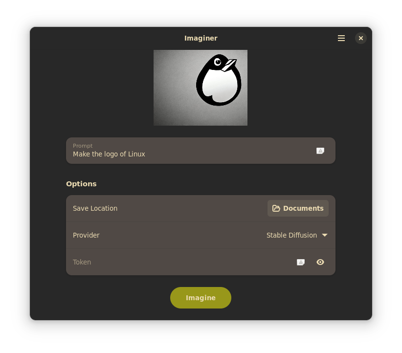

<h1 align="center">
  
  <br>
  Imaginer
</h1>

<p align="center">
  <strong>Imagine with AI</strong>
</p>

<p align="center">
  <a href="https://flathub.org/apps/details/io.github.ImaginerApp.Imaginer">
    
  </a>
  <br>
</p>

<br>

<p align="center">
 <a href="https://translate.codeberg.org/engage/Imaginer/">
  
  </a>
  <a href="https://repology.org/project/Imaginer/versions">
    
  </a>
</p>

<p align="center">
  <a href="https://stopthemingmy.app">
    
  </a>
</p>

<p align="center">
  
</p>

## Installation

### Flatpak

#### Flathub

> **Warn**: This app isn't yet on Flathub

##### Release

#### From Source

Clone the repo and run `flatpak-builder`

```
git clone https://codeberg.org/Imaginer/Imaginer # or https://github.com/ImaginerApp/Imaginer
cd Imaginer
flatpak-builder --install --user --force-clean repo/ build-aux/flatpak/io.github.ImaginerApp.Imaginer.json
```

## Contribute

The [GNOME Code of Conduct](https://wiki.gnome.org/Foundation/CodeOfConduct) is applicable to this project

### Translate

<a href="https://translate.codeberg.org/engage/Imaginer/">

</a>

You can translate Imaginer using Codeberg Translate
