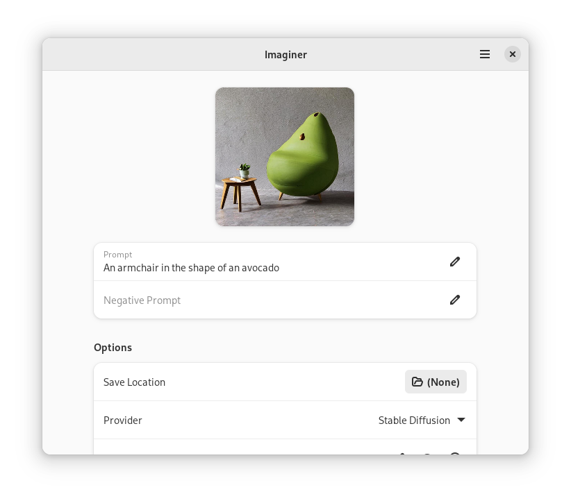

<h1 align="center">
  
  <br>
  Imaginer
</h1>

<p align="center">
  <strong>Imagine with AI</strong>
</p>

<p align="center">
  <a href="https://flathub.org/apps/details/page.codeberg.Imaginer.Imaginer">
    
  </a>
  <br>
</p>

<br>

<p align="center">
 <a href="https://translate.codeberg.org/engage/Imaginer/">
  
  </a>
  <a href="https://repology.org/project/Imaginer/versions">
    
  </a>
</p>

<p align="center">
  <a href="https://stopthemingmy.app">
    
  </a>
</p>

<p align="center">
  
</p>

## Installation

### Flatpak

#### Flathub

You can either use your GNOME Software and search for "Imaginer" or you can run

```
flatpak install page.codeberg.Imaginer.Imaginer
```

##### Release

#### From Source

Clone the repo and run `flatpak-builder`

```
git clone https://codeberg.org/Imaginer/Imaginer.git # or https://github.com/ImaginerApp/Imaginer.git
cd Imaginer
flatpak-builder --install --user --force-clean repo/ build-aux/flatpak/page.codeberg.Imaginer.Imaginer.json
```

## Contribute

The [GNOME Code of Conduct](https://wiki.gnome.org/Foundation/CodeOfConduct) is applicable to this project

### Release

- Bump meson version in `meson.build`
- Bump version in the About dialog in `src/main.py`
- Add release notes to `data/page.codeberg.Imaginer.Imaginer.appdata.xml.in`

### Translate

<a href="https://translate.codeberg.org/engage/Imaginer/">

</a>

You can translate Imaginer using Codeberg Translate

### Mirrors

- [GitHub](https://github.com/ImaginerApp/Imaginer)
- [Codeberg](https://github.com/Imaginer/Imaginer)


## See also 

### Bavarder: Chit-Chat with AI

A tool for chatting with diverse AI

- https://github.com/Bavarder/Bavarder
- https://codeberg.org/Bavarder/Bavarder
