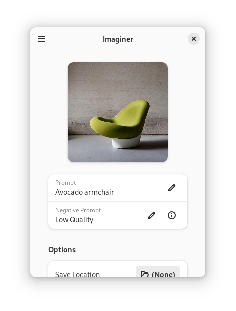

<a href="https://imaginer.codeberg.page">
<h1 align="center">
  
  <br>
  Imaginer
</h1>

<p align="center">
  <strong>Imagine with an AI</strong>
</p>
</a>

<p align="center">
  <a href="https://flathub.org/apps/details/page.codeberg.Imaginer.Imaginer">
    
  </a>
  <br>
</p>

<br>

<p align="center">
 <a href="https://translate.codeberg.org/engage/imaginer/">
  
  </a>
  <a href="https://repology.org/project/imaginer/versions">
    
  </a>
  <a href="https://ci.exozy.me/Imaginer/Imaginer" target="_blank">
    
  </a>
</p>

<p align="center">
  <a href="https://stopthemingmy.app">
    
  </a>
</p>

<a href="https://imaginer.codeberg.page">
<p align="center">
  
</p>
</a>

## Installation

### Flatpak

#### Flathub

You can either use your GNOME Software and search for "Imaginer" or you can run

``` shell
flatpak install page.codeberg.Imaginer.Imaginer
```

#### Latest build from CI

You can download the build from the latest commit from [the package registry](https://codeberg.org/Imaginer/-/packages/generic/imaginer/) and install it by running 

``` shell
flatpak install imaginer.flatpak
```

#### From Source

Clone the repo and run `flatpak-builder`

``` shell
git clone https://codeberg.org/Imaginer/Imaginer # or https://github.com/Imaginer/Imaginer
cd Imaginer
flatpak-builder --install --user --force-clean repo/ build-aux/flatpak/page.codeberg.Imaginer.Imaginer.json
```

### Others

You can see more install methods on the [website](https://imaginer.codeberg.page/install/)

## Contribute

The [GNOME Code of Conduct](https://wiki.gnome.org/Foundation/CodeOfConduct) is applicable to this project

### Translate

<a href="https://translate.codeberg.org/engage/imaginer/">

</a>

You can translate Imaginer using Codeberg Translate

### Mirrors

- [GitHub](https://github.com/ImaginerApp/Imaginer)
- [Codeberg](https://codeberg.org/Imaginer/Imaginer)

## See also 

### [Bavarder : Chit-Chat with AI](https://bavarder.codeberg.page)

A tool for chatting with AI right from your desktop

- [GitHub](https://github.com/Bavarder/Bavarder)
- [Codeberg](https://codeberg.org/Bavarder/Bavarder)
